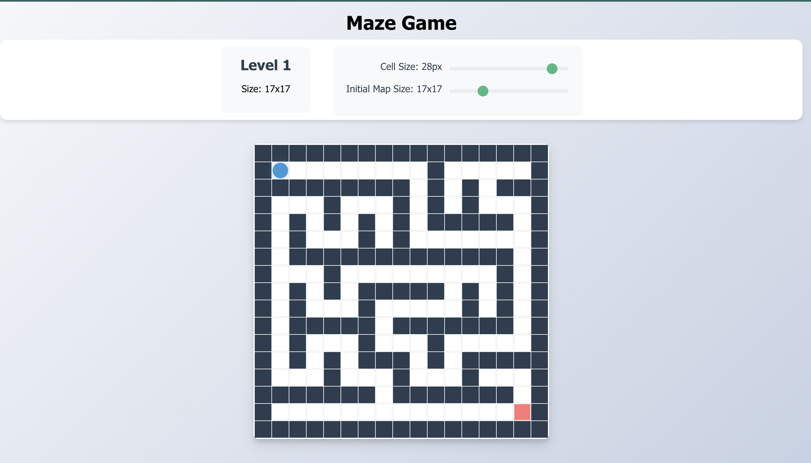

# 🎮 Vue Maze Challenge

一个充满趣味的迷宫游戏，使用 Vue 3 + TypeScript 开发。在这里，你将面临不断增大的迷宫挑战！

这是一个利用 LLM 创建的项目，画了 2 小时，中间有少量人工代码，其他都是大模型完成的。



## ✨ 特性

- 🎲 自动生成随机迷宫
- 📈 渐进式难度（从 5x5 到 51x51）
- 🎵 互动音效
- 🎨 优雅的动画效果
- 📱 响应式设计
- ⌨️ 键盘控制

## 🎯 游戏玩法

1. 使用方向键（↑ ↓ ← →）控制蓝色玩家
2. 从绿色起点到达红色终点
3. 每通过一关，迷宫尺寸增加
4. 调整单元格大小让游戏更适合你的屏幕

## 🛠️ 技术栈

- Vue 3
- TypeScript
- CSS3 动画
- 迷宫生成算法

## 🚀 快速开始

```bash
# 安装依赖
npm install

# 启动开发服务器
npm run serve

# 构建生产版本
npm run build
```

## 🎛️ 自定义配置

- 单元格大小: 10-30px
- 初始迷宫大小: 5x5 到 51x51
- 音效音量: 30%

## 🎶 音效提示

- 移动：轻快的脚步声
- 撞墙：碰撞音效
- 胜利：欢快的胜利音乐

## 💡 游戏提示

1. 迷宫总是有一条从起点到终点的路径
2. 墙壁是不可穿越的
3. 每一关的迷宫都会比上一关更大
4. 最终挑战是 51x51 的超大迷宫！

## 📱 移动设备支持

游戏完全支持移动设备，可以通过调整单元格大小来获得最佳体验。

## 🤝 贡献

欢迎提出建议和改进！请随时提交 PR 或创建 Issue。

## 📜 许可证

本项目采用 [MIT License](./LICENSE) 许可证。

你可以自由地：
- 使用本项目的代码
- 修改本项目的代码
- 将本项目用于商业用途

唯一的要求是保留原始许可证和版权声明。

详细信息请查看 [LICENSE](./LICENSE) 文件。
